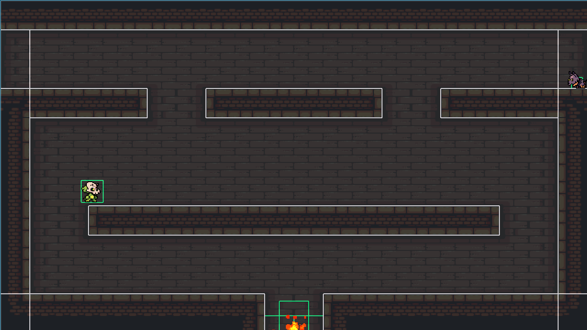
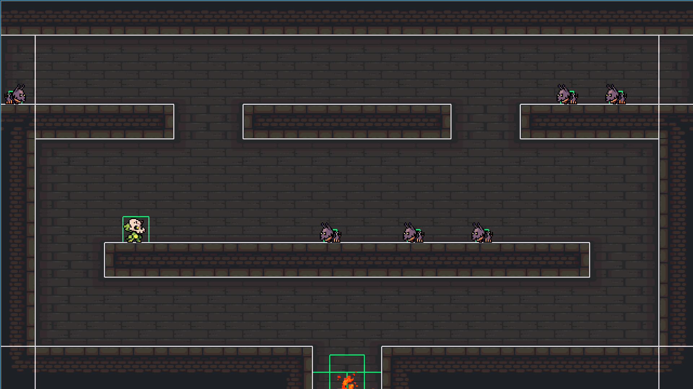
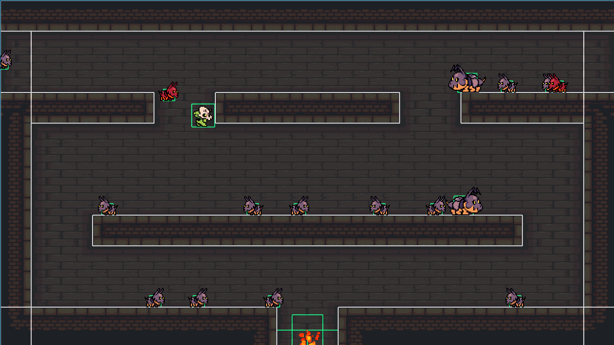
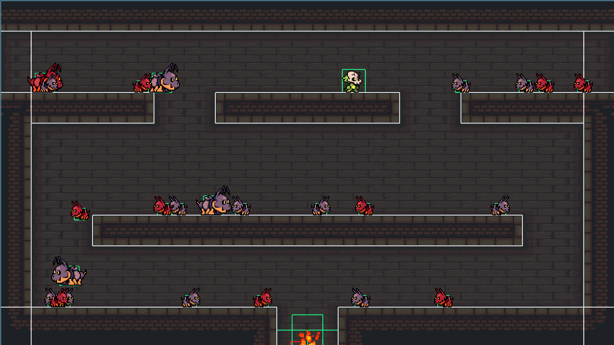
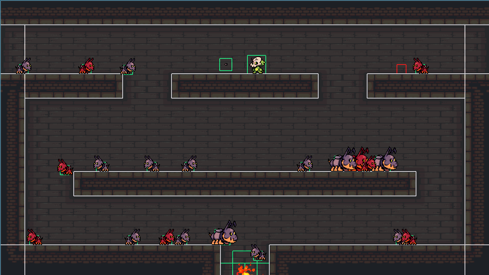
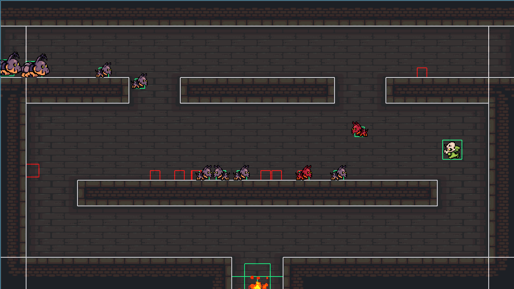
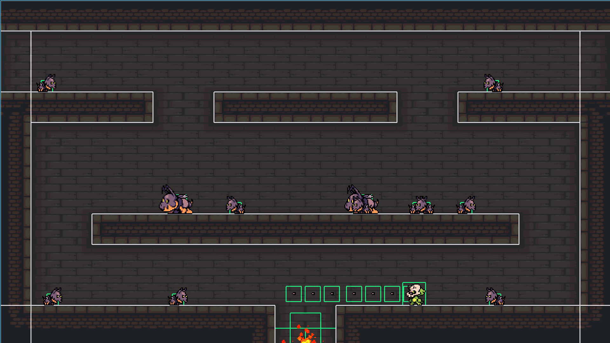

# Project_1_2D_Platformer

A simple 2D platformer game written primarily in **C**, with **GLSL** used for graphics and shader programming.

The project was developed from the ground up, including the core systems required to create and run a 2D game.

## Features

- 2D platformer gameplay
- Custom physics engine
- 2D rendering pipeline
- Character animation system
- Sound effects
- GLSL shaders
- Keyboard input and game controls
- Collision detection

## Technologies

- **C** – Main programming language
- **GLSL** – Graphics shaders
- **OpenGL** – Rendering

## Controls

| Key | Action |
|---|---|
| W | Jump |
| A | Move left |
| D | Move right |
| E | Shoot |

## Project Structure

```text
.
├── build
│   └── CMakeFiles
├── engine_from_scratch 
│   ├── src/          # C source code
│   ├── shaders/      # GLSL shaders
│   ├── assets/       # Textures, sounds and other assets
│   └── config.ini
├── include/          # Header files
│   ├── KHR/
│   ├── glad/
│   └── linmath.h
├── CMakeLists.txt
├── config.ini
└── README.md
```
## Screenshots







``
